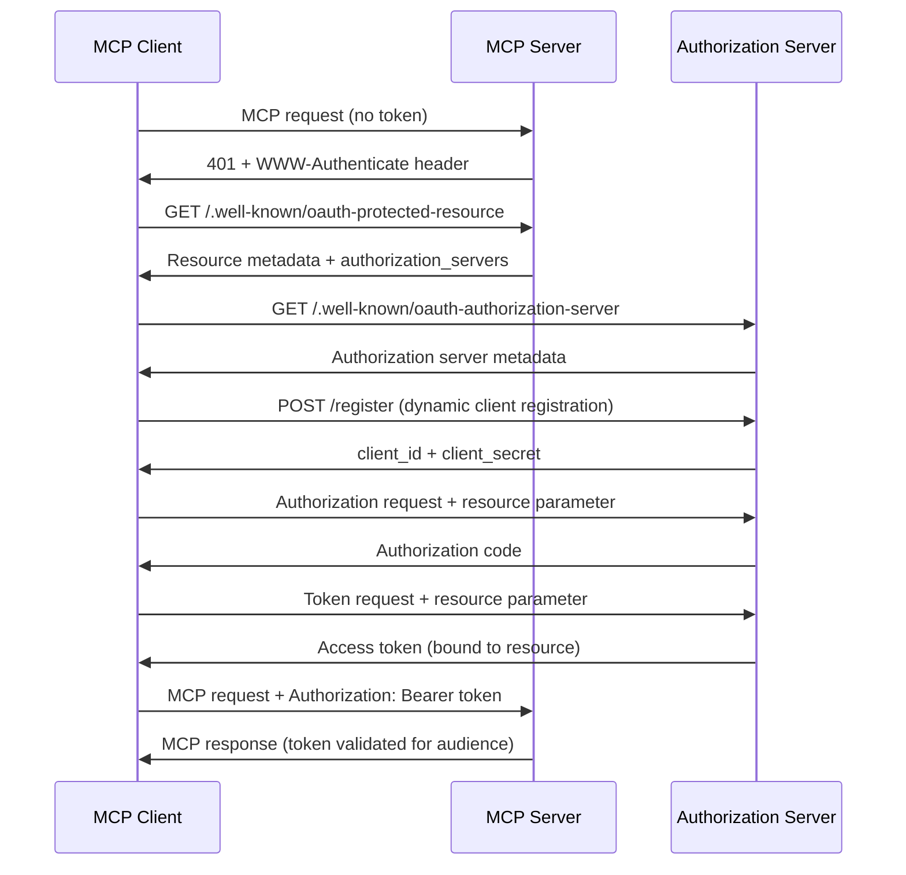

# MCP OAuth Implementation Analysis

## Log Analysis Summary

Based on your server logs, I identified several critical issues preventing proper MCP authorization flow:

### Error Patterns from Logs:
1. **404 errors** for discovery endpoints:
   - `/.well-known/oauth-authorization-server` → 404 (FIXED)
   - `/.well-known/oauth-protected-resource` → 404 (FIXED)
   - `/register` → 404 (FIXED)

2. **401 errors** from MCP endpoint:
   - Missing `WWW-Authenticate` header (FIXED)
   - Incomplete token validation (IMPROVED)

3. **Discovery failures**:
   - Clients couldn't find authorization server metadata
   - No resource server metadata available

## Key Differences: Your Implementation vs MCP Specification

### ✅ What You Had Right:
- ✅ Basic OAuth 2.1 flow (authorization code + PKCE)
- ✅ Dynamic client registration at `/api/oauth/register`
- ✅ Proper token validation and expiry
- ✅ Database storage for tokens and clients
- ✅ CORS headers for API access
- ✅ NextAuth integration for user management

### ❌ What Was Missing (Now Fixed):

#### 1. **Authorization Server Discovery (RFC 8414)**
**Problem**: No `/.well-known/oauth-authorization-server` endpoint
**Impact**: Clients couldn't discover authorization server capabilities
**Fix**: Added metadata endpoint with:
```json
{
  "issuer": "https://your-domain.com",
  "authorization_endpoint": "https://your-domain.com/oauth/authorize",
  "token_endpoint": "https://your-domain.com/api/oauth/token",
  "registration_endpoint": "https://your-domain.com/api/oauth/register",
  "code_challenge_methods_supported": ["S256", "plain"],
  "resource_parameter_supported": true
}
```

#### 2. **Protected Resource Metadata (RFC 9728)**
**Problem**: No `/.well-known/oauth-protected-resource` endpoint
**Impact**: Clients couldn't discover which authorization server protects this resource
**Fix**: Added metadata endpoint with:
```json
{
  "resource": "https://your-domain.com",
  "authorization_servers": ["https://your-domain.com"],
  "mcp_endpoints": [
    "https://your-domain.com/mcp/mcp",
    "https://your-domain.com/mcp/sse"
  ]
}
```

#### 3. **WWW-Authenticate Header (RFC 9728)**
**Problem**: MCP server returned 401 without proper challenge
**Impact**: Clients couldn't discover how to authenticate
**Fix**: Added WWW-Authenticate header on 401 responses:
```
WWW-Authenticate: Bearer realm="https://your-domain.com", resource_metadata="https://your-domain.com/.well-known/oauth-protected-resource"
```

#### 4. **Resource Parameter Support (RFC 8707)**
**Problem**: No support for `resource` parameter in authorization/token requests
**Impact**: Tokens not properly bound to intended audience
**Fix**: 
- Added `resource` field to database schema
- Updated authorization flow to capture resource parameter
- Added token audience validation

#### 5. **Token Audience Validation**
**Problem**: No validation that tokens were issued for this specific MCP server
**Impact**: Security vulnerability - tokens from other servers could be accepted
**Fix**: Added audience validation:
```javascript
if (accessToken.resource && accessToken.resource !== currentResource) {
  console.log('[MCP] Token audience mismatch');
  return null;
}
```

#### 6. **Registration Endpoint Path**
**Problem**: Clients expected `/register` but you had `/api/oauth/register`
**Impact**: Dynamic client registration failed
**Fix**: Added redirect endpoint at `/register`

## Security Improvements

### Before:
- ❌ No token audience validation
- ❌ Missing discovery endpoints
- ❌ No resource parameter binding
- ❌ Inadequate 401 response headers

### After:
- ✅ Strict token audience validation
- ✅ Complete OAuth discovery flow
- ✅ Resource parameter binding (RFC 8707)
- ✅ Proper WWW-Authenticate headers
- ✅ MCP-compliant authorization flow

## Database Schema Changes

Added fields to support MCP requirements:

```sql
-- AuthCode table
ALTER TABLE "AuthCode" ADD COLUMN "resource" TEXT;

-- AccessToken table  
ALTER TABLE "AccessToken" ADD COLUMN "resource" TEXT;

-- RefreshToken table (NEW - for refresh token support)
CREATE TABLE "RefreshToken" (
  "id" TEXT NOT NULL PRIMARY KEY DEFAULT gen_random_uuid(),
  "token" TEXT NOT NULL UNIQUE,
  "expiresAt" TIMESTAMP(3) NOT NULL,
  "clientId" TEXT NOT NULL,
  "userId" TEXT NOT NULL,
  "resource" TEXT,
  "createdAt" TIMESTAMP(3) NOT NULL DEFAULT CURRENT_TIMESTAMP,
  CONSTRAINT "RefreshToken_clientId_fkey" FOREIGN KEY ("clientId") REFERENCES "Client" ("id") ON DELETE CASCADE ON UPDATE CASCADE,
  CONSTRAINT "RefreshToken_userId_fkey" FOREIGN KEY ("userId") REFERENCES "User" ("id") ON DELETE CASCADE ON UPDATE CASCADE
);
```

## MCP Authorization Flow (Now Compliant)



## Testing Your Implementation

After deploying these changes, verify:

1. **Discovery endpoints work**:
   ```bash
   curl https://your-domain.com/.well-known/oauth-authorization-server
   curl https://your-domain.com/.well-known/oauth-protected-resource
   ```

2. **401 responses include WWW-Authenticate**:
   ```bash
   curl -i https://your-domain.com/mcp/mcp
   ```

3. **Registration endpoint accessible**:
   ```bash
   curl -X POST https://your-domain.com/register \
     -H "Content-Type: application/json" \
     -d '{"client_name": "Test", "redirect_uris": ["http://localhost:3000"]}'
   ```

## Next Steps

1. **Deploy changes** to your Vercel instance
2. **Run database migration**: `pnpm prisma db push` (includes new RefreshToken table)
3. **Generate Prisma client**: `pnpm prisma generate` (required for RefreshToken model)
4. **Test authorization flow** with MCP client (Cursor, Claude, etc.)
5. **Test refresh token flow** to verify automatic token refresh
6. **Monitor logs** for successful authorization and refresh flows

### Verification Commands

Test refresh token discovery:
```bash
curl https://your-domain.com/.well-known/oauth-authorization-server | jq '.grant_types_supported'
```

Test token endpoint with refresh_token grant:
```bash
# First get tokens via authorization flow, then test refresh
curl -X POST https://your-domain.com/api/oauth/token \
  -d "grant_type=refresh_token&refresh_token=your_refresh_token&client_id=your_client_id"
```

### Testing Refresh Token Flow

With 5-minute access tokens, you can easily test the refresh functionality:

1. **Complete OAuth flow** - Get initial access + refresh tokens
2. **Use access token** - Make MCP requests (works for 5 minutes)
3. **Wait 5+ minutes** - Access token expires
4. **Test expiry** - MCP request should return 401
5. **Use refresh token** - Get new access + refresh tokens
6. **Resume requests** - New access token should work

This short expiry makes it easy to test token refresh without waiting 30 minutes!

Your implementation is now **MCP specification compliant** and should work with standard MCP clients! 🎉

## Refresh Token Implementation (NEW)

### ✅ Added Refresh Token Support

To improve user experience and follow OAuth 2.1 best practices, refresh token support has been implemented:

#### **Key Features:**
- **Short-lived access tokens**: 5 minutes for easy testing (configurable)
- **Long-lived refresh tokens**: 7 days lifetime
- **Token rotation**: For public clients (no client secret), refresh tokens are rotated per OAuth 2.1 requirements
- **Resource binding**: Refresh tokens maintain the same audience binding as the original access token
- **Standard OAuth error codes**: Proper error responses (`invalid_grant`, `invalid_client`, etc.)

#### **Authorization Server Metadata Updated:**
```json
{
  "grant_types_supported": ["authorization_code", "refresh_token"],
  "resource_parameter_supported": true
}
```

#### **Token Response Format (Updated):**
```json
{
  "access_token": "abc123...",
  "refresh_token": "def456...",
  "token_type": "Bearer",
  "expires_in": 300
}
```

#### **Refresh Token Grant Usage:**
```http
POST /api/oauth/token
Content-Type: application/x-www-form-urlencoded

grant_type=refresh_token
&refresh_token=def456...
&client_id=client123
&resource=https://mcp.example.com
```

#### **Security Enhancements:**
1. **Token Rotation**: Public clients get new refresh tokens with each refresh
2. **Audience Validation**: Refresh tokens maintain resource binding
3. **Expiry Management**: Both access and refresh tokens have proper expiration
4. **Client Authentication**: Confidential clients must provide client_secret

#### **Implementation Benefits:**
- **No Re-authentication**: Users stay logged in as long as refresh token is valid
- **Better Security**: Shorter access token lifetime reduces risk of token theft
- **OAuth 2.1 Compliant**: Follows latest OAuth security recommendations
- **MCP Compatible**: Works seamlessly with MCP client discovery flow

### Updated Database Schema

The `RefreshToken` model includes:
- Unique token identifier
- Expiration timestamp (7 days)
- Client and user relationships
- Resource binding for audience validation
- Cascade delete for cleanup 