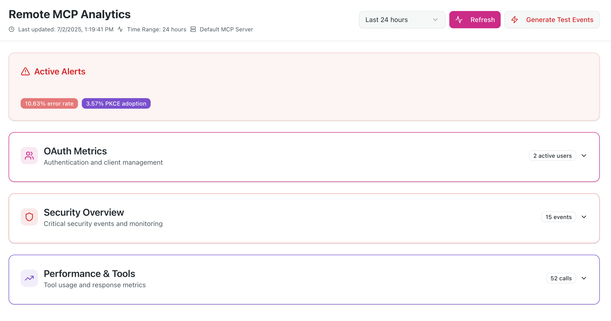
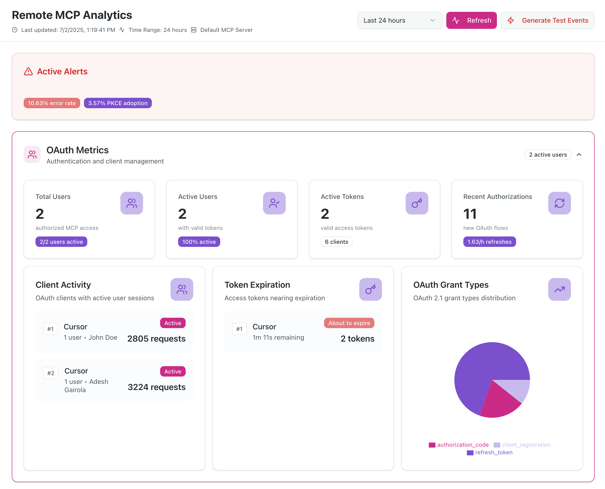
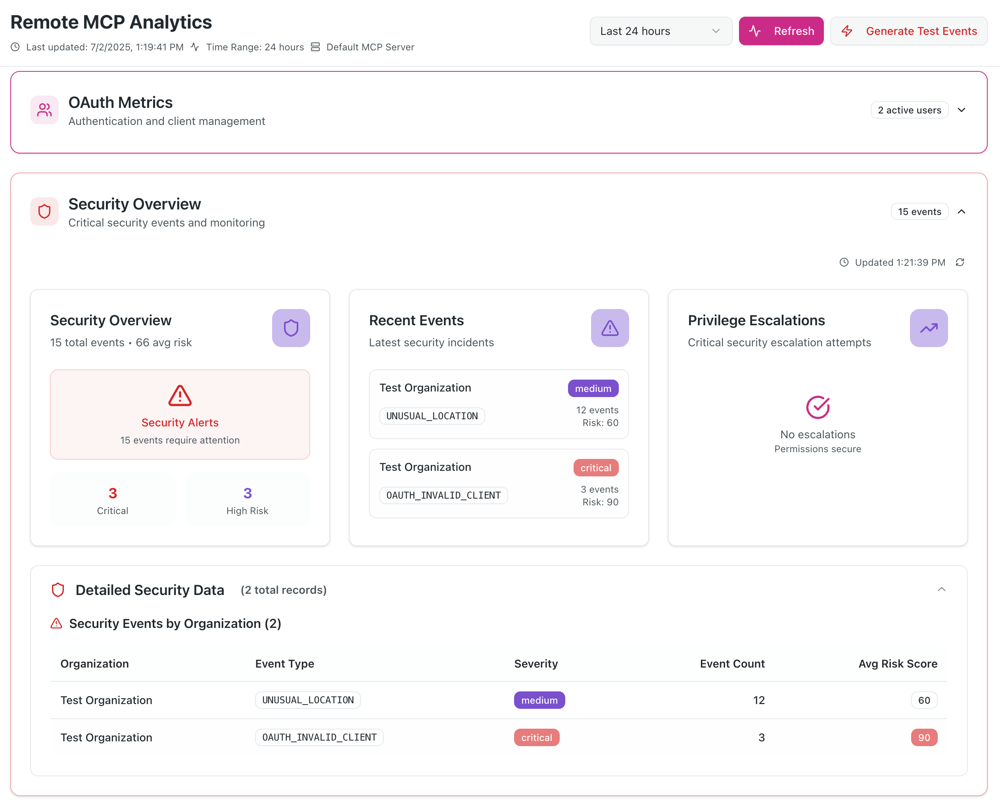
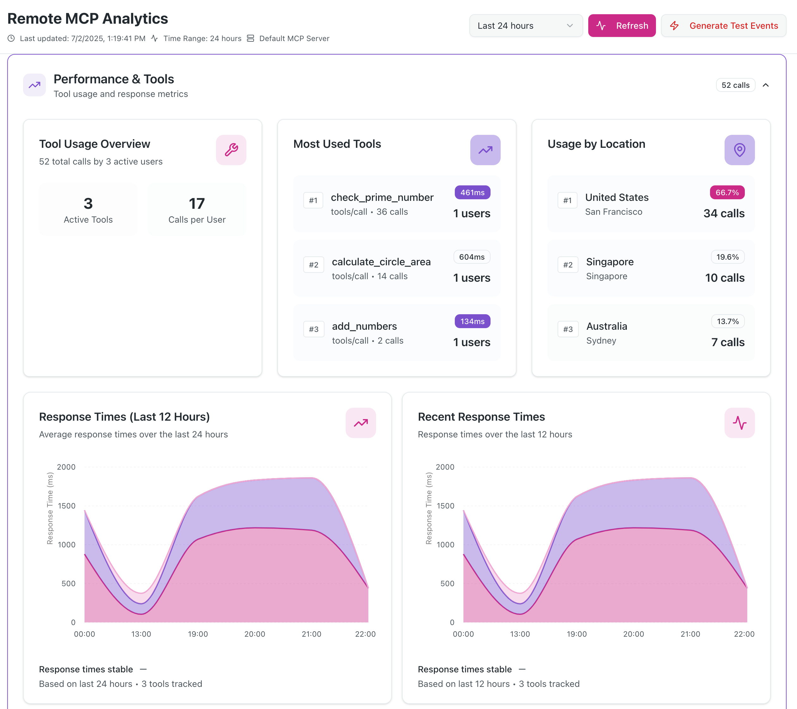

# MCP OAuth Sample on Vercel and Analytics 

A production-ready MCP (Model Context Protocol) OAuth 2.1 server implementation built with Next.js 15, providing secure authentication and analytics for MCP clients.

## Overview

This project was built using [run-llama/mcp-nextjs](https://github.com/run-llama/mcp-nextjs) as a reference implementation and significantly enhanced to be fully compliant with the [MCP Authorization Specification](./SPEC_MCP_AUTHZ.md) or [here](https://modelcontextprotocol.io/specification/2025-06-18/basic/authorization). 

### Key Enhancements

✅ **OAuth 2.1 Compliance** - Full implementation of MCP authorization specification  
✅ **OAuth Refresh Tokens** - Automatic token refresh for seamless user experience  
✅ **DIY Analytics Dashboard** - Real-time analytics with security monitoring  
✅ **Enhanced Security** - Comprehensive threat detection and monitoring  

## Quick Start

```bash
# Install dependencies
pnpm install

# Setup environment variables (see docs/setup.md)
cp .env.example .env

# Setup database
pnpm prisma generate
pnpm prisma db push

# Start development server
pnpm dev
```

## Screenshots

### Dashboard
<!-- Add screenshot of the main analytics dashboard -->


### OAuth Usage Metrics
<!-- Add screenshot of the OAuth consent screen -->


### DIY Security Monitoring
<!-- Add screenshot of security events and monitoring -->


### MCP Clients Tools Usage
<!-- Add screenshot showing MCP client connection -->


## Features

- **Complete OAuth 2.1 Server** with PKCE and refresh token support
- **MCP Authorization Flow** compliant with latest MCP specification
- **Analytics Dashboard** with real-time security monitoring
- **Google Authentication** integration via NextAuth.js
- **Dynamic Client Registration** for seamless MCP client onboarding
- **Security Monitoring** with threat detection and alerting
- **PostgreSQL Database** with automated cleanup and TTL management

## Documentation

**📚 [View Full Documentation](https://raxitai.github.io/mcp-oauth-sample/)** - Interactive Material for MkDocs site


### Local Documentation Development

```bash
# Serve documentation locally with hot reload
./docs-serve.sh

# Or on Windows
docs-serve.bat

# Manual setup
pip install -r requirements.txt
mkdocs serve
```

## MCP Specification Compliance

We have attempted to implement all the mandatory requirements specified in the MCP Authorization Specification. 

### What Makes This Different

- **Discovery Endpoints** - Proper RFC 8414 and RFC 9728 implementation
- **Resource Parameter Support** - RFC 8707 Resource Indicators implementation  
- **Token Audience Validation** - Strict security boundary enforcement
- **Refresh Token Flow** - OAuth 2.1 compliant token refresh
- **WWW-Authenticate Headers** - Proper 401 response handling
- **Dynamic Client Registration** - RFC 7591 support for MCP clients

## Quick Links

- **Live Demo**: [mcp-oauth-sample.vercel.app](https://mcp-oauth-sample.vercel.app) *(Analytics dashboard requires Gmail address allowlist)*
- **Analytics Dashboard**: `/analytics` (supports multiple Gmail addresses)
- **MCP Endpoints**: 
  - SSE: `/mcp/sse`
  - HTTP: `/mcp/mcp`
- **OAuth Discovery**: `/.well-known/oauth-authorization-server`

## MCP Client Integration

### For Claude Desktop/Web
```json
{
  "mcpServers": {
    "raxIT-oauth": {
      "url": "https://your-domain.com/mcp/sse",
      "transport": "sse"
    }
  }
}
```

### For Cursor
```json
{
  "mcpServers": {
    "raxIT-oauth": {
      "url": "https://your-domain.com/mcp/mcp", 
      "transport": "http-stream"
    }
  }
}
```

## Contributing

We warmly welcome contributions from the community! This project is open source and we encourage developers to help make it even better.

### Ways to Contribute

🐛 **Report Bugs** - Found an issue? [Open a bug report](https://github.com/raxITai/mcp-oauth-sample/issues/new?template=bug_report.md)  
✨ **Request Features** - Have an idea? [Submit a feature request](https://github.com/raxITai/mcp-oauth-sample/issues/new?template=feature_request.md)  
📝 **Improve Documentation** - Help make our docs clearer and more comprehensive  
🔧 **Submit Code** - Fix bugs, add features, or improve performance  
🧪 **Add Tests** - Help us increase test coverage and reliability  
🎨 **Enhance UI/UX** - Make the analytics dashboard even better  

### Getting Started

1. **Fork** the repository to your GitHub account
2. **Clone** your fork: `git clone https://github.com/your-username/mcp-oauth-sample.git`
3. **Install dependencies**: `pnpm install`
4. **Set up environment**: Follow our [Setup Guide](./docs/setup.md)
5. **Create a branch**: `git checkout -b feature/your-feature-name`
6. **Make your changes** and test thoroughly
7. **Commit**: Use [Conventional Commits](https://conventionalcommits.org/) format
8. **Push** and create a Pull Request

### Development Guidelines

- **Code Style**: Follow existing patterns and use ESLint/Prettier
- **Testing**: Add tests for new features and ensure existing tests pass
- **Documentation**: Update relevant docs for any changes
- **Security**: Follow security best practices, especially for OAuth flows
- **Performance**: Consider analytics and monitoring impact

### Community

- 💬 **Discussions**: Join conversations in [GitHub Discussions](https://github.com/raxITai/mcp-oauth-sample/discussions)
- 💼 **LinkedIn**: Follow us on [LinkedIn](https://www.linkedin.com/company/raxit-ai)
- 🐦 **X (Twitter)**: Follow [@raxit_ai](https://x.com/raxit_ai) for updates
- 🦋 **Bluesky**: Connect on [Bluesky](https://bsky.app/profile/raxit.ai)

**All contributors are welcome!** Whether you're fixing typos, adding major features, or helping with docs - every contribution matters. 🙏

## License

This project is licensed under the Apache License 2.0 - see the [LICENSE](./LICENSE) file for details.

## Support

- **Issues**: [GitHub Issues](https://github.com/raxITai/mcp-oauth-sample/issues)
- **Documentation**: [docs/](./docs/)


---

**Built with ❤️ by [raxIT AI](https://raxit.ai)**

*Based on [run-llama/mcp-nextjs](https://github.com/run-llama/mcp-nextjs) with enhancements to learn MCP authz.*