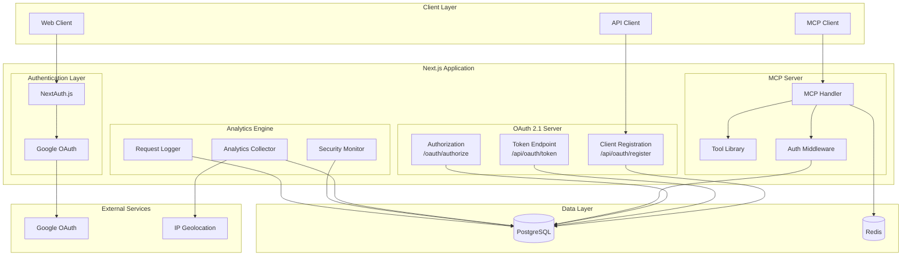
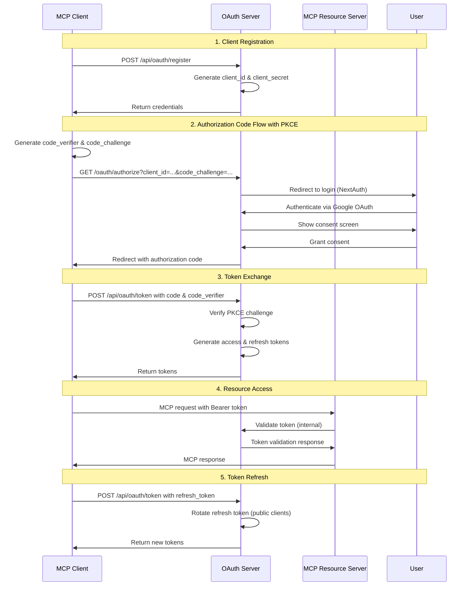
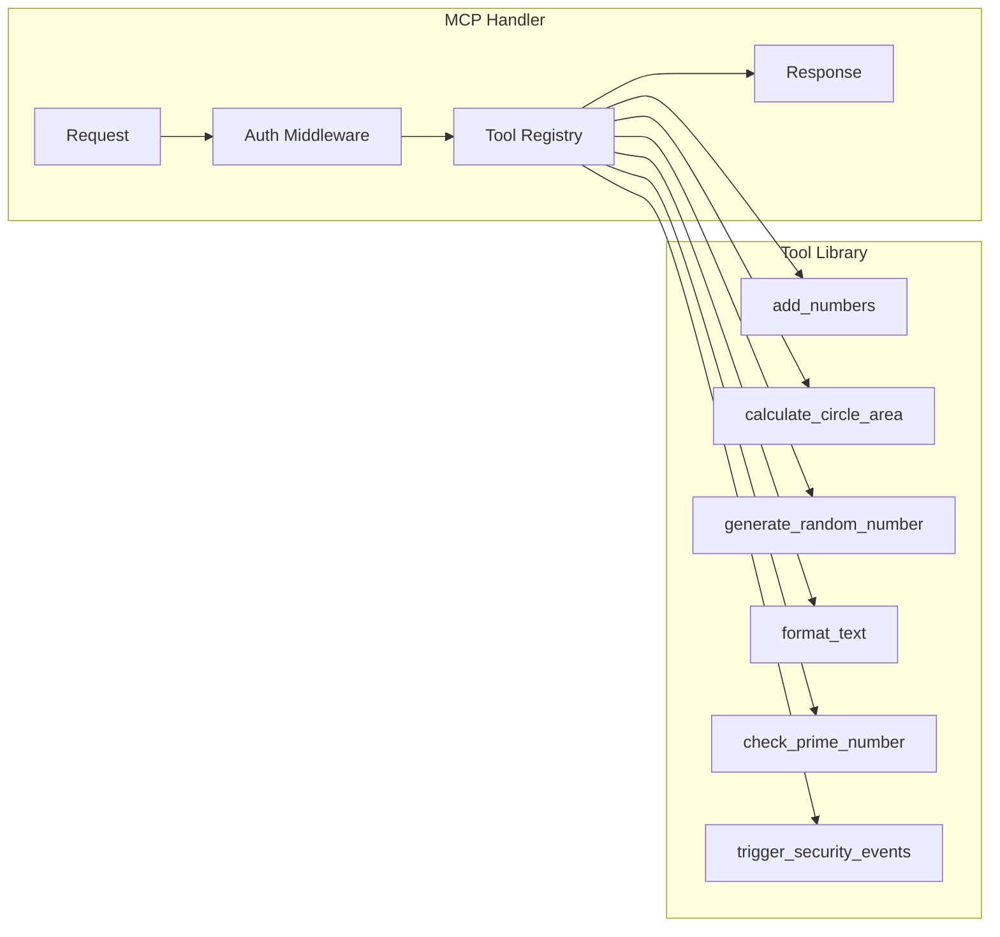
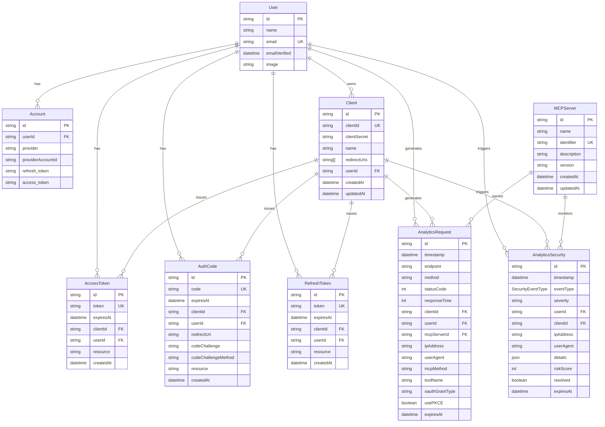
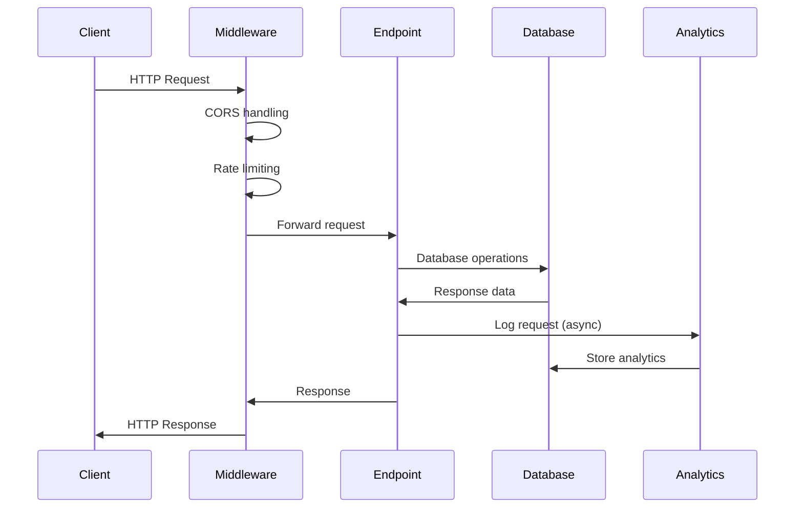
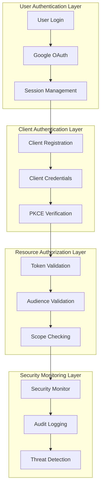
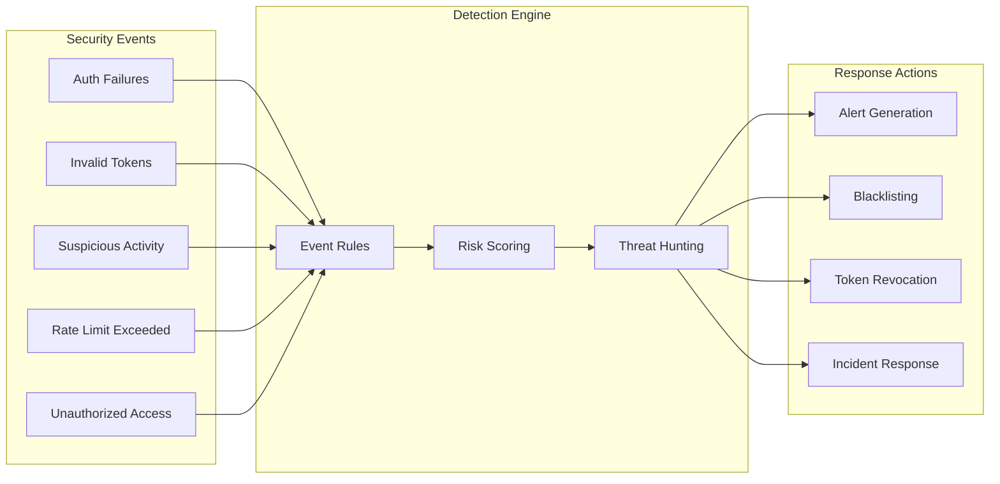
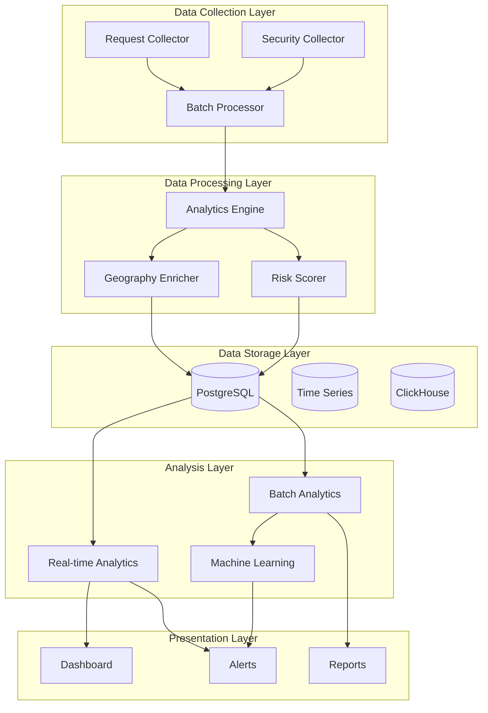

# MCP OAuth 2.1 Server Architecture Documentation

## Table of Contents

1. [System Architecture Overview](#system-architecture-overview)
2. [OAuth 2.1 Implementation Details](#oauth-21-implementation-details)
3. [MCP Protocol Integration](#mcp-protocol-integration)
4. [Database Schema and Models](#database-schema-and-models)
5. [API Endpoints Architecture](#api-endpoints-architecture)
6. [Authentication & Authorization Flow](#authentication--authorization-flow)
7. [Security Architecture](#security-architecture)
8. [Analytics System Design](#analytics-system-design)
9. [Technology Stack](#technology-stack)
10. [File Structure and Organization](#file-structure-and-organization)

---

## System Architecture Overview

The MCP OAuth 2.1 Server is a comprehensive authentication and authorization system designed to secure Model Context Protocol (MCP) interactions. The system implements OAuth 2.1 with PKCE (Proof Key for Code Exchange) to provide secure authentication for MCP clients while maintaining compatibility with modern security standards.

### High-Level Architecture



### Core Design Principles

1. **Security-First Design**: All components implement security by default with OAuth 2.1 and PKCE
2. **Scalable Architecture**: Built on Next.js with edge-ready components and efficient database queries
3. **Comprehensive Monitoring**: Full request lifecycle tracking with security event monitoring
4. **Standards Compliance**: Adheres to OAuth 2.1 RFC and MCP protocol specifications
5. **Performance Optimization**: Batched analytics, connection pooling, and efficient caching

---

## OAuth 2.1 Implementation Details

### OAuth 2.1 Features Implemented

The system implements OAuth 2.1 as defined in [RFC 6749](https://tools.ietf.org/html/rfc6749) with [OAuth 2.1 Security Best Practices](https://tools.ietf.org/html/draft-ietf-oauth-security-topics-19):

#### Core Grant Types
- **Authorization Code Grant with PKCE**: Primary flow for MCP clients
- **Refresh Token Grant**: Token rotation for long-lived sessions
- **Dynamic Client Registration**: RFC 7591 compliant client registration

#### Security Enhancements (OAuth 2.1)
- **Mandatory PKCE**: S256 code challenge method for public clients
- **Refresh Token Rotation**: Automatic rotation for public clients
- **Token Audience Validation**: Prevents cross-resource token misuse
- **Short-lived Access Tokens**: 5-minute expiry for enhanced security

### OAuth Flow Diagram



### PKCE Implementation

The system implements PKCE (Proof Key for Code Exchange) as specified in [RFC 7636](https://tools.ietf.org/html/rfc7636):

```typescript
// PKCE validation in token endpoint
if (authCode.codeChallenge) {
  if (authCode.codeChallengeMethod === 'S256') {
    const hash = createHash('sha256').update(code_verifier).digest();
    const base64url = hash.toString('base64')
      .replace(/\+/g, '-')
      .replace(/\//g, '_')
      .replace(/=+$/, '');
    pkceValid = base64url === authCode.codeChallenge;
  }
}
```

---

## MCP Protocol Integration

### MCP Server Architecture

The MCP server is implemented using the `@vercel/mcp-adapter` and provides secure access to tools and resources through OAuth 2.1 authentication.

#### MCP Handler Components



#### Authentication Middleware

The MCP server implements comprehensive authentication middleware:

```typescript
async function authenticateRequest(request: NextRequest) {
  const authHeader = request.headers.get('authorization');
  const token = authHeader?.split(' ')[1];
  
  // Validate token against database
  const accessToken = await prisma.accessToken.findUnique({
    where: { token },
    include: { client: true, user: true }
  });
  
  // Check expiration
  if (accessToken.expiresAt < new Date()) {
    return null;
  }
  
  // Validate token audience (critical security requirement)
  const currentResource = `${protocol}://${host}`;
  if (accessToken.resource && accessToken.resource !== currentResource) {
    return null;
  }
  
  return accessToken;
}
```

#### Tool Implementation

Tools are implemented using Zod schema validation and provide structured responses:

```typescript
server.tool(
  "add_numbers",
  "Adds two numbers together and returns the sum",
  {
    a: z.number().describe("First number to add"),
    b: z.number().describe("Second number to add"),
  },
  async ({ a, b }) => {
    return {
      content: [
        {
          type: "text",
          text: `The sum of ${a} and ${b} is ${a + b}`,
        },
      ],
    };
  }
);
```

### MCP Transport Support

The system supports multiple MCP transport mechanisms:

- **SSE Transport**: `/mcp/sse` - Server-Sent Events for real-time communication
- **HTTP Transport**: `/mcp/mcp` - Standard HTTP request/response
- **WebSocket Transport**: Future implementation planned

---

## Database Schema and Models

### Schema Overview

The database schema is designed to support both OAuth 2.1 requirements and comprehensive analytics collection:



### Key Design Decisions

1. **Separate Token Models**: Distinct models for access tokens, refresh tokens, and auth codes for better security and performance
2. **PKCE Support**: Built-in code challenge and method fields in AuthCode model
3. **Resource Audience**: Token audience validation to prevent cross-resource attacks
4. **Analytics Integration**: Comprehensive request and security event tracking
5. **TTL Management**: Automatic expiration using PostgreSQL intervals

### Indexes and Performance

Critical indexes for optimal performance:

```sql
-- Request analytics indexes
CREATE INDEX idx_analytics_timestamp ON "AnalyticsRequest"(timestamp);
CREATE INDEX idx_analytics_endpoint ON "AnalyticsRequest"(endpoint);
CREATE INDEX idx_analytics_client_time ON "AnalyticsRequest"(timestamp, "clientId");
CREATE INDEX idx_analytics_user_time ON "AnalyticsRequest"(timestamp, "userId");

-- Security event indexes
CREATE INDEX idx_security_timestamp ON "AnalyticsSecurity"(timestamp);
CREATE INDEX idx_security_event_type ON "AnalyticsSecurity"("eventType");
CREATE INDEX idx_security_risk_score ON "AnalyticsSecurity"("riskScore");

-- OAuth token indexes
CREATE UNIQUE INDEX idx_access_token ON "AccessToken"(token);
CREATE INDEX idx_access_token_expiry ON "AccessToken"("expiresAt");
CREATE UNIQUE INDEX idx_refresh_token ON "RefreshToken"(token);
```

---

## API Endpoints Architecture

### Endpoint Categories

The API is organized into several logical categories:

#### OAuth 2.1 Endpoints

| Endpoint | Method | Purpose | OAuth 2.1 Spec |
|----------|---------|---------|-----------------|
| `/api/oauth/register` | POST | Dynamic client registration | RFC 7591 |
| `/api/oauth/token` | POST | Token exchange and refresh | RFC 6749 |
| `/oauth/authorize` | GET | Authorization endpoint | RFC 6749 |

#### MCP Server Endpoints

| Endpoint | Method | Purpose | Transport |
|----------|---------|---------|-----------|
| `/mcp/sse` | GET/POST | MCP over Server-Sent Events | SSE |
| `/mcp/mcp` | GET/POST | MCP over HTTP | HTTP |

#### Analytics Endpoints

| Endpoint | Method | Purpose | Access |
|----------|---------|---------|---------|
| `/api/analytics/collect` | POST | Request analytics collection | Internal |
| `/api/analytics/security` | POST | Security event logging | Internal |
| `/api/analytics` | GET | Analytics dashboard data | Authenticated |

#### Authentication Endpoints (NextAuth)

| Endpoint | Method | Purpose | Provider |
|----------|---------|---------|----------|
| `/api/auth/signin` | GET/POST | User authentication | Google OAuth |
| `/api/auth/callback` | GET/POST | OAuth callback | Google OAuth |
| `/api/auth/signout` | POST | User sign out | NextAuth |

### Request/Response Flow



### Error Handling Strategy

The system implements comprehensive error handling following OAuth 2.1 specifications:

#### OAuth Error Responses

```json
{
  "error": "invalid_client",
  "error_description": "Client authentication failed",
  "error_uri": "https://example.com/errors#invalid_client"
}
```

#### MCP Error Responses

```json
{
  "jsonrpc": "2.0",
  "id": "request_id",
  "error": {
    "code": -32600,
    "message": "Invalid Request",
    "data": { "details": "Authentication required" }
  }
}
```

---

## Authentication & Authorization Flow

### Multi-Layer Security Model

The system implements a multi-layer security model combining user authentication, client authentication, and resource authorization:



### Detailed Authorization Flow

#### 1. User Authentication (NextAuth.js)

```typescript
// NextAuth configuration
export const authConfig = {
  adapter: PrismaAdapter(prisma),
  providers: [
    Google({
      clientId: process.env.GOOGLE_CLIENT_ID!,
      clientSecret: process.env.GOOGLE_CLIENT_SECRET!,
    }),
  ],
  callbacks: {
    // Session and JWT callbacks for enhanced security
  },
  trustHost: true,
};
```

#### 2. Client Authentication (OAuth 2.1)

```typescript
// Dynamic client registration
const newClient = await prisma.client.create({
  data: {
    name: client_name,
    redirectUris: redirect_uris,
    clientSecret: clientSecret, // Hashed in production
    userId: null, // Allow unauthenticated clients
  },
});
```

#### 3. Authorization Code Flow

```typescript
// Authorization endpoint with PKCE
const authorizationCode = randomBytes(16).toString('hex');
await prisma.authCode.create({
  data: {
    code: authorizationCode,
    expiresAt: new Date(Date.now() + 10 * 60 * 1000), // 10 minutes
    clientId: client.id,
    userId: session.user.id,
    redirectUri: redirectUri,
    codeChallenge: code_challenge,
    codeChallengeMethod: code_challenge_method,
    resource: resource,
  },
});
```

#### 4. Token Exchange and Validation

```typescript
// Token exchange with PKCE verification
if (authCode.codeChallenge) {
  if (authCode.codeChallengeMethod === 'S256') {
    const hash = createHash('sha256').update(code_verifier).digest();
    const base64url = hash.toString('base64')
      .replace(/\+/g, '-')
      .replace(/\//g, '_')
      .replace(/=+$/, '');
    pkceValid = base64url === authCode.codeChallenge;
  }
}
```

### Security Context Propagation

The system maintains security context across all layers:

1. **User Context**: User identity, roles, and permissions
2. **Client Context**: Client identity, type (public/confidential), and allowed resources
3. **Request Context**: IP address, user agent, geographic location
4. **Resource Context**: Target resource, required scopes, and access policies

---

## Security Architecture

### Defense in Depth Strategy

The system implements multiple layers of security controls:

#### 1. Transport Security
- **HTTPS Everywhere**: All communication encrypted in transit
- **HSTS Headers**: HTTP Strict Transport Security
- **Certificate Pinning**: For high-security deployments

#### 2. Authentication Security
- **Multi-Factor Authentication**: Google OAuth with optional 2FA
- **Session Management**: Secure session handling with NextAuth.js
- **Token Security**: Short-lived access tokens with refresh rotation

#### 3. Authorization Security
- **PKCE Mandatory**: Proof Key for Code Exchange for all flows
- **Audience Validation**: Prevents token misuse across resources
- **Scope Enforcement**: Granular permission control

#### 4. Application Security
- **Input Validation**: Zod schema validation for all inputs
- **SQL Injection Prevention**: Parameterized queries with Prisma
- **XSS Protection**: Content Security Policy and input sanitization

#### 5. Infrastructure Security
- **Rate Limiting**: Request throttling and abuse prevention
- **CORS Configuration**: Secure cross-origin resource sharing
- **Security Headers**: Comprehensive security header implementation

### Security Monitoring



### Security Event Types

The system monitors and responds to various security events:

```typescript
enum SecurityEventType {
  AUTH_FAILURE = "AUTH_FAILURE",
  INVALID_TOKEN = "INVALID_TOKEN", 
  SUSPICIOUS_ACTIVITY = "SUSPICIOUS_ACTIVITY",
  RATE_LIMIT_EXCEEDED = "RATE_LIMIT_EXCEEDED",
  UNAUTHORIZED_ACCESS = "UNAUTHORIZED_ACCESS",
  TOKEN_REUSE = "TOKEN_REUSE",
  UNUSUAL_LOCATION = "UNUSUAL_LOCATION",
  PRIVILEGE_ESCALATION = "PRIVILEGE_ESCALATION",
  MALFORMED_REQUEST = "MALFORMED_REQUEST",
  BRUTE_FORCE_ATTEMPT = "BRUTE_FORCE_ATTEMPT"
}
```

### Risk Scoring Algorithm

Security events are scored based on multiple factors:

1. **Event Severity**: Critical, High, Medium, Low
2. **User Risk Profile**: Historical behavior, privilege level
3. **Client Risk Profile**: Client type, registration age, usage patterns
4. **Context Risk**: Geographic location, time of day, device fingerprint
5. **Behavioral Analysis**: Deviation from normal patterns

---

## Analytics System Design

### Analytics Architecture

The analytics system is designed for high-performance data collection and real-time analysis:



### Performance Optimizations

#### Batched Data Collection

```typescript
class OptimizedAnalyticsCollector {
  private requestBatch: RequestAnalytics[] = [];
  private readonly BATCH_SIZE = 100;
  private readonly FLUSH_INTERVAL = 15000; // 15 seconds
  
  async logRequest(data: RequestAnalytics) {
    this.requestBatch.push(data);
    
    if (this.requestBatch.length >= this.BATCH_SIZE) {
      await this.flushRequests();
    }
  }
  
  private async flushRequests() {
    await prisma.$transaction(async (tx) => {
      await tx.analyticsRequest.createMany({
        data: this.requestBatch.map(req => ({...req})),
        skipDuplicates: true
      });
    });
  }
}
```

#### Efficient Database Queries

```sql
-- Optimized performance metrics query
SELECT 
  COUNT(*) as total_requests,
  AVG("responseTime") as avg_response_time,
  PERCENTILE_CONT(0.95) WITHIN GROUP (ORDER BY "responseTime") as p95_response_time,
  CASE 
    WHEN COUNT(*) = 0 THEN 0
    ELSE COUNT(CASE WHEN "statusCode" >= 400 THEN 1 END) * 100.0 / COUNT(*)
  END as error_rate
FROM "AnalyticsRequest"
WHERE timestamp >= $1;
```

### Key Metrics Tracked

#### Performance Metrics
- **Request Volume**: Requests per second, hourly, daily
- **Response Times**: Average, P95, P99 response times
- **Error Rates**: 4xx and 5xx error percentages
- **Throughput**: Data transfer rates

#### Security Metrics
- **Authentication Failures**: Failed login attempts
- **Token Abuse**: Invalid or expired token usage
- **Geographic Anomalies**: Unusual access patterns
- **Risk Scores**: Calculated security risk levels

#### Business Metrics
- **User Engagement**: Active users, session duration
- **API Usage**: Tool usage patterns, popular endpoints
- **Client Activity**: OAuth client usage statistics
- **Growth Metrics**: User acquisition, retention rates

### Data Retention and Cleanup

```typescript
// Automatic data cleanup with TTL
model AnalyticsRequest {
  // TTL field - automatically set to 14 days from creation
  expiresAt DateTime @default(dbgenerated("NOW() + INTERVAL '14 days'"))
  
  @@index([expiresAt])
}

// Cleanup job
async cleanupOldData(daysOld = 30) {
  const cutoff = new Date(Date.now() - daysOld * 24 * 60 * 60 * 1000);
  
  await prisma.analyticsRequest.deleteMany({
    where: { timestamp: { lt: cutoff } }
  });
}
```

---

## Technology Stack

### Core Technologies

#### Frontend Technologies
- **Next.js 15**: React framework with App Router
- **TypeScript**: Type-safe JavaScript development
- **Tailwind CSS**: Utility-first CSS framework
- **Radix UI**: Accessible component library
- **Framer Motion**: Animation library

#### Backend Technologies
- **Node.js**: JavaScript runtime environment
- **Next.js API Routes**: Serverless API endpoints
- **Prisma ORM**: Type-safe database toolkit
- **NextAuth.js**: Authentication library
- **Zod**: Runtime type validation

#### Database Technologies
- **PostgreSQL**: Primary relational database
- **Redis**: Caching and session storage (optional)
- **Prisma Client**: Generated database client

#### Security Technologies
- **OAuth 2.1**: Authorization framework
- **PKCE**: Proof Key for Code Exchange
- **Google OAuth**: Identity provider
- **JWT**: JSON Web Tokens for sessions

#### MCP Technologies
- **@modelcontextprotocol/sdk**: MCP protocol implementation
- **@vercel/mcp-adapter**: MCP server adapter
- **Server-Sent Events**: Real-time communication
- **WebSocket**: Bidirectional communication (future)

### Architectural Patterns

#### Design Patterns Used

1. **Repository Pattern**: Data access abstraction
2. **Factory Pattern**: Client and token creation
3. **Observer Pattern**: Analytics event handling
4. **Adapter Pattern**: MCP protocol adaptation
5. **Middleware Pattern**: Request/response processing

#### Architectural Patterns

1. **Layered Architecture**: Clear separation of concerns
2. **Microservices**: Modular service decomposition
3. **Event-Driven Architecture**: Asynchronous event processing
4. **CQRS**: Command Query Responsibility Segregation for analytics
5. **Saga Pattern**: Distributed transaction management

### Development Tools

#### Code Quality
- **ESLint**: JavaScript/TypeScript linting
- **Prettier**: Code formatting
- **TypeScript**: Static type checking
- **Husky**: Git hooks for quality gates

#### Testing Framework
- **Jest**: Unit testing framework
- **React Testing Library**: Component testing
- **Cypress**: End-to-end testing
- **Playwright**: Cross-browser testing

#### DevOps Tools
- **Docker**: Containerization
- **Vercel**: Deployment platform
- **GitHub Actions**: CI/CD pipeline
- **Prisma Migrate**: Database migrations

---

## File Structure and Organization

### Project Structure

```
mcp-oauth-sample/
├── app/                          # Next.js App Router
│   ├── api/                      # API routes
│   │   ├── auth/                 # NextAuth.js endpoints
│   │   │   └── [...nextauth]/    # Dynamic auth routes
│   │   ├── oauth/                # OAuth 2.1 endpoints
│   │   │   ├── register/         # Client registration
│   │   │   └── token/            # Token endpoint
│   │   ├── analytics/            # Analytics endpoints
│   │   │   ├── collect/          # Data collection
│   │   │   ├── security/         # Security events
│   │   │   └── generate-threats/ # Test data generation
│   │   └── cleanup/              # Data cleanup jobs
│   ├── mcp/                      # MCP server implementation
│   │   └── [transport]/          # Dynamic transport routes
│   ├── oauth/                    # OAuth UI pages
│   │   └── authorize/            # Authorization consent
│   ├── analytics/                # Analytics dashboard
│   ├── auth.ts                   # NextAuth configuration
│   ├── prisma.ts                 # Prisma client setup
│   ├── layout.tsx                # Root layout component
│   └── page.tsx                  # Home page
├── components/                   # Reusable React components
│   ├── analytics/                # Analytics components
│   │   ├── dashboard-header.tsx  # Dashboard header
│   │   ├── metric-card.tsx       # Metric display cards
│   │   ├── oauth-overview.tsx    # OAuth metrics
│   │   ├── security-panel.tsx    # Security dashboard
│   │   └── tool-usage-panel.tsx  # MCP tool usage
│   ├── ui/                       # Base UI components
│   │   ├── button.tsx            # Button component
│   │   ├── card.tsx              # Card component
│   │   ├── chart.tsx             # Chart components
│   │   └── ...                   # Other UI components
│   ├── theme-provider.tsx        # Theme context
│   └── theme-toggle.tsx          # Dark/light mode toggle
├── lib/                          # Utility libraries
│   ├── analytics-db.ts           # Analytics database layer
│   ├── security-monitor.ts       # Security monitoring
│   └── utils.ts                  # General utilities
├── prisma/                       # Database schema and migrations
│   └── schema.prisma             # Prisma schema definition
├── docs/                         # Documentation
│   ├── architecture.md           # This file
│   └── setup.md                  # Setup instructions
├── middleware.ts                 # Next.js middleware
├── next.config.ts                # Next.js configuration
├── package.json                  # Dependencies and scripts
├── tailwind.config.js            # Tailwind CSS configuration
├── tsconfig.json                 # TypeScript configuration
└── README.md                     # Project overview
```

### Code Organization Principles

#### Separation of Concerns
- **API Layer**: Handle HTTP requests and responses
- **Business Logic**: Implement core authentication and authorization
- **Data Layer**: Manage database operations and caching
- **Presentation Layer**: Render UI components and manage state

#### Module Boundaries
- **Authentication Module**: NextAuth.js integration and session management
- **OAuth Module**: OAuth 2.1 server implementation
- **MCP Module**: Model Context Protocol server and tools
- **Analytics Module**: Data collection and analysis
- **Security Module**: Threat detection and monitoring

#### Naming Conventions
- **Files**: kebab-case for component files, camelCase for utilities
- **Components**: PascalCase for React components
- **Functions**: camelCase for function names
- **Constants**: UPPER_SNAKE_CASE for constants
- **Types**: PascalCase for TypeScript types and interfaces

### Key Files Explained

#### Core Configuration Files

**`app/auth.ts`** - NextAuth.js configuration with Google OAuth provider and Prisma adapter

**`app/prisma.ts`** - Prisma client singleton with optimized connection handling

**`prisma/schema.prisma`** - Complete database schema with OAuth 2.1 and analytics models

#### API Implementation Files

**`app/api/oauth/token/route.ts`** - OAuth 2.1 token endpoint with PKCE support and refresh token rotation

**`app/api/oauth/register/route.ts`** - Dynamic client registration per RFC 7591

**`app/mcp/[transport]/route.ts`** - MCP server with authentication middleware and tool implementations

#### Analytics and Security Files

**`lib/analytics-db.ts`** - High-performance analytics collection with batching and optimized queries

**`lib/security-monitor.ts`** - Security event detection and threat analysis

**`app/api/analytics/collect/route.ts`** - Analytics data collection endpoint

#### UI and Dashboard Files

**`app/analytics/page.tsx`** - Main analytics dashboard with real-time metrics

**`components/analytics/`** - Specialized analytics components for different metric types

**`app/oauth/authorize/page.tsx`** - OAuth authorization consent screen

### Development Workflow

#### Local Development Setup
1. **Environment Setup**: Configure PostgreSQL, Redis, and environment variables
2. **Database Migration**: Run Prisma migrations and generate client
3. **Development Server**: Start Next.js development server
4. **Testing**: Run unit tests and end-to-end tests

#### Production Deployment
1. **Build Process**: Generate optimized production build
2. **Database Deployment**: Apply migrations to production database
3. **Security Configuration**: Configure security headers and SSL
4. **Monitoring Setup**: Deploy analytics and monitoring infrastructure

---

## Conclusion

This MCP OAuth 2.1 Server represents a comprehensive implementation of modern authentication and authorization patterns specifically designed for Model Context Protocol interactions. The architecture emphasizes security, performance, and observability while maintaining compliance with relevant standards and specifications.

The system's modular design allows for easy extension and customization, while the comprehensive analytics and security monitoring provide the visibility needed for production deployment. The technology choices reflect current best practices in web development, security, and database design.

For questions or contributions, please refer to the project documentation and follow the established development workflows.
