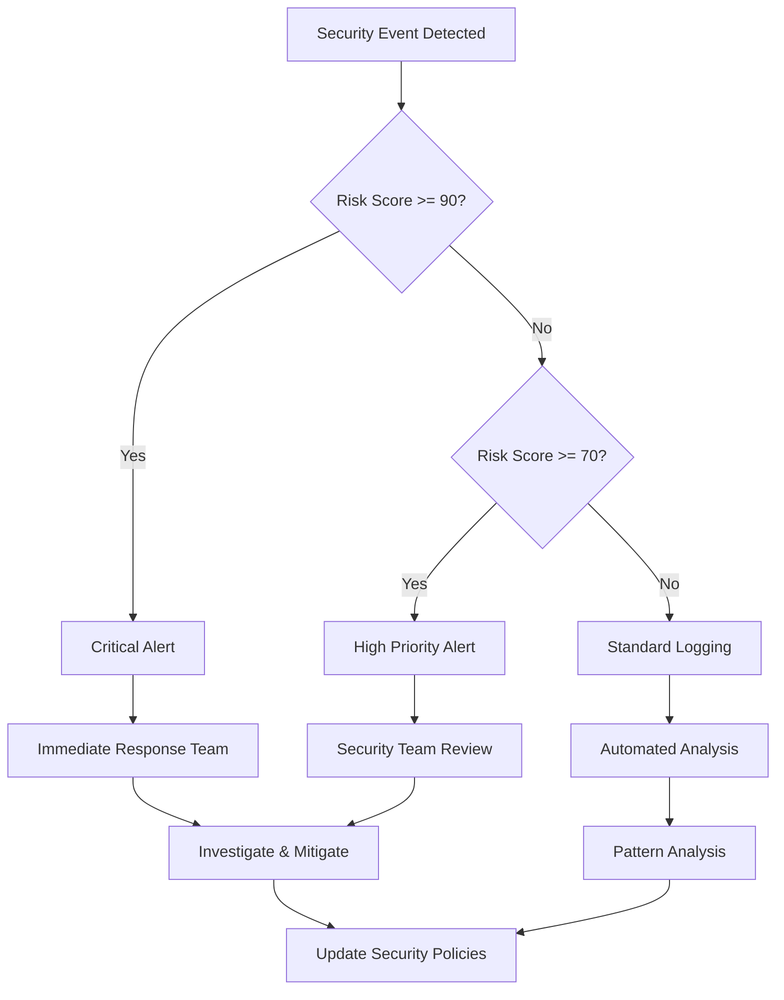

# MCP OAuth 2.1 Security Documentation

## Table of Contents

1. [Security Overview and Philosophy](#security-overview-and-philosophy)
2. [OAuth 2.1 Security Implementation](#oauth-21-security-implementation)
3. [MCP-Specific Security Measures](#mcp-specific-security-measures)
4. [Threat Detection System](#threat-detection-system)
5. [Security Monitoring & Analytics](#security-monitoring--analytics)
6. [Token Security and Management](#token-security-and-management)
7. [Database Security](#database-security)
8. [API Security](#api-security)
9. [Security Configuration Guide](#security-configuration-guide)
10. [Incident Response](#incident-response)
11. [Compliance and Standards](#compliance-and-standards)

## Security Overview and Philosophy

### Core Security Principles

This MCP OAuth 2.1 server implementation follows a **defense-in-depth** security model with the following core principles:

- **Zero Trust Architecture**: All requests are authenticated and authorized regardless of source
- **OAuth 2.1 Compliance**: Full implementation of OAuth 2.1 security features including mandatory PKCE
- **Real-time Threat Detection**: Advanced security monitoring with behavioral analytics
- **Token Audience Validation**: Strict enforcement of token scope and audience restrictions
- **Comprehensive Audit Logging**: Full traceability of all security events and user actions

### Security Architecture

```
┌─────────────────────────────────────────────────────────────┐
│                    Security Layers                          │
├─────────────────────────────────────────────────────────────┤
│ 1. Transport Security (HTTPS/TLS)                          │
│ 2. Authentication Layer (NextAuth + OAuth 2.1)             │
│ 3. Authorization Layer (Token Validation + Audience)       │
│ 4. MCP Protocol Security (Bearer Token + Resource)         │
│ 5. Database Security (Encrypted Storage + Access Control)  │
│ 6. Monitoring Layer (Real-time Threat Detection)           │
│ 7. Analytics Layer (Security Event Logging + SIEM)        │
└─────────────────────────────────────────────────────────────┘
```

## OAuth 2.1 Security Implementation

### Core OAuth 2.1 Features

#### 1. Mandatory PKCE (Proof Key for Code Exchange)

**Implementation**: All authorization code flows require PKCE, eliminating code interception attacks.

**Detection**: The system monitors for PKCE bypass attempts:

```typescript
// From lib/security-monitor.ts
private async checkPKCEBypass(context: SecurityContext): Promise<SecurityEvent | null> {
  const nonPKCERequests = recentOAuthRequests.filter(r => r.usePKCE === false);
  
  if (nonPKCERequests.length > 0) {
    return {
      eventType: SecurityEventType.OAUTH_INVALID_CLIENT,
      severity: 'critical',
      riskScore: 90,
      details: {
        reason: 'Authorization code flow without PKCE protection (OAuth 2.1 violation)'
      }
    };
  }
}
```

#### 2. Refresh Token Rotation

**Public Clients**: Refresh tokens are automatically rotated on each use to prevent replay attacks.

**Confidential Clients**: Refresh tokens remain valid but are monitored for suspicious usage patterns.

```typescript
// From app/api/oauth/token/route.ts
if (!client.clientSecret) {
  console.log('[RefreshToken] Rotating refresh token for public client');
  await prisma.refreshToken.delete({ where: { id: refreshTokenRecord.id } });
}
```

#### 3. Resource Parameter Support

**Token Audience Validation**: Access tokens include resource parameter for strict audience validation.

```typescript
// From app/mcp/[transport]/route.ts
if (accessToken.resource && accessToken.resource !== currentResource) {
  await logSecurityEvent(request, 'suspicious_activity', 
    `Token audience mismatch. Expected: ${currentResource}, Got: ${accessToken.resource}`);
  return null;
}
```

### Security Event Types

The system monitors for the following OAuth-specific threats:

| Event Type | Risk Score | Description |
|------------|------------|-------------|
| `OAUTH_INVALID_CLIENT` | 90 | Invalid client credentials or PKCE bypass attempts |
| `OAUTH_INVALID_GRANT` | 80 | Invalid authorization codes or redirect URI mismatches |
| `OAUTH_INVALID_SCOPE` | 75 | Unauthorized scope requests or privilege escalation |

## MCP-Specific Security Measures

### 1. MCP Server Authentication

All MCP requests require valid OAuth 2.1 Bearer tokens:

```typescript
// Authentication middleware in MCP handler
const accessToken = await authenticateRequest(nextReq);
if (!accessToken) {
  return new Response(JSON.stringify({ error: 'Unauthorized' }), {
    status: 401,
    headers: { 
      'WWW-Authenticate': `Bearer realm="${baseUrl}", resource_metadata="${baseUrl}/.well-known/oauth-protected-resource"`
    }
  });
}
```

### 2. Token Passthrough Detection

The system detects potential token passthrough attacks where tokens are used across multiple MCP servers:

```typescript
// From lib/security-monitor.ts
private async checkTokenPassthrough(context: SecurityContext): Promise<SecurityEvent | null> {
  // Detect rapid cross-service requests (potential token passthrough)
  if (serverChanges.length >= 2) {
    return {
      eventType: SecurityEventType.SUSPICIOUS_ACTIVITY,
      severity: 'high',
      riskScore: 85,
      details: {
        reason: 'Rapid cross-MCP server access pattern suggests potential token passthrough'
      }
    };
  }
}
```

### 3. MCP Resource Registration

Automatic registration and tracking of MCP servers for security monitoring:

```typescript
// Auto-registration in MCP handler
let mcpServer = await prisma.mCPServer.findUnique({
  where: { identifier: serverIdentifier }
});

if (!mcpServer) {
  mcpServer = await prisma.mCPServer.create({
    data: {
      name: 'Default MCP Server',
      identifier: serverIdentifier,
      description: 'MCP OAuth Server',
      version: '1.0.0'
    }
  });
}
```

## Threat Detection System

### Real-time Security Monitoring

The `SecurityMonitor` class (`lib/security-monitor.ts`) implements comprehensive threat detection:

#### 1. Rate Limiting Detection
- **Threshold**: 30 requests per minute per IP
- **Risk Score**: 20-80 (based on excess requests)
- **Action**: Automatic blocking and alerting

#### 2. Brute Force Detection
- **Threshold**: 5 failed authentication attempts in 15 minutes
- **Risk Score**: 90
- **Pattern**: Multiple auth failures from same IP

#### 3. Privilege Escalation Detection
- **Monitoring**: OAuth scope changes and elevated permissions
- **Risk Score**: 75-95 (based on scope elevation)
- **Detection**: New elevated scopes not previously granted

```typescript
const elevatedScopePatterns = [
  'admin', 'write', 'delete', 'manage', 'owner', 'super',
  'all', 'full', 'root', 'system', 'config'
];

const newElevatedScopes = newScopes.filter(scope =>
  elevatedScopePatterns.some(pattern => 
    scope.toLowerCase().includes(pattern)
  )
);
```

#### 4. Token Reuse Detection
- **Detection**: Same token used from different IP addresses within 5 minutes
- **Risk Score**: 85
- **Mitigation**: Token invalidation and user notification

#### 5. Geographic Anomaly Detection
- **Monitoring**: Access from unusual geographic locations
- **Risk Score**: 60
- **Baseline**: User's historical access patterns

### Security Event Risk Scoring

| Risk Score Range | Severity | Action |
|------------------|----------|---------|
| 0-25 | Low | Log only |
| 26-50 | Medium | Log + Monitor |
| 51-75 | High | Log + Alert |
| 76-100 | Critical | Log + Alert + Auto-block |

## Security Monitoring & Analytics

### Real-time Analytics Collection

The `OptimizedAnalyticsCollector` (`lib/analytics-db.ts`) provides high-performance security event collection:

#### Batched Processing
- **Batch Size**: 100 events
- **Flush Interval**: 15 seconds
- **Performance**: Non-blocking, async processing

#### Enhanced Context Tracking
```typescript
interface SecurityEvent {
  timestamp: Date;
  eventType: SecurityEventType;
  severity: 'low' | 'medium' | 'high' | 'critical';
  userId?: string;
  clientId?: string;
  ipAddress: string;
  userAgent: string;
  riskScore: number;
  details: Record<string, unknown>;
}
```

### Security Dashboard Metrics

#### Key Performance Indicators (KPIs)
- **Total Security Events**: Count of all security events by severity
- **Risk Score Distribution**: Average and P95 risk scores
- **Threat Categories**: Breakdown by event type
- **Geographic Distribution**: Security events by location
- **Response Times**: Time to detection and resolution

#### Organization-level Security Analytics
```typescript
async getSecurityEventsByOrganization(hoursBack = 24) {
  return await prisma.$queryRaw`
    SELECT 
      organization,
      "eventType",
      severity,
      COUNT(*) as event_count,
      AVG("riskScore") as avg_risk_score
    FROM "AnalyticsSecurity"
    WHERE timestamp >= ${cutoff}
      AND organization IS NOT NULL
      AND "riskScore" >= 50
    GROUP BY organization, "eventType", severity
    ORDER BY event_count DESC
  `;
}
```

## Token Security and Management

### Access Token Security

#### Token Generation
- **Algorithm**: Cryptographically secure random bytes (32 bytes = 256 bits)
- **Format**: Hexadecimal encoding
- **Lifetime**: 5 minutes (configurable for production use)

```typescript
const accessToken = randomBytes(32).toString('hex');
const accessTokenExpiresAt = new Date(Date.now() + 5 * 60 * 1000);
```

#### Token Storage
- **Database**: PostgreSQL with indexed lookups
- **Hashing**: Tokens stored in plaintext for lookup (consider hashing for production)
- **Expiration**: Automatic cleanup via database TTL

#### Token Validation Process
1. **Existence Check**: Token exists in database
2. **Expiration Check**: Token not expired
3. **Client Validation**: Token belongs to authenticated client
4. **Audience Validation**: Token valid for requested resource
5. **Security Monitoring**: Log usage patterns

### Refresh Token Security

#### Rotation Strategy
- **Public Clients**: Immediate rotation on use (OAuth 2.1 requirement)
- **Confidential Clients**: Optional rotation with monitoring
- **Lifetime**: 7 days (configurable)

#### Security Features
- **One-time Use**: Refresh tokens invalidated after use (public clients)
- **Client Binding**: Refresh tokens bound to specific client
- **Resource Inheritance**: New tokens inherit resource scope

## Database Security

### Schema Security Features

#### Data Encryption
- **Transport**: TLS encryption for all database connections
- **At Rest**: PostgreSQL encryption capabilities
- **Sensitive Fields**: Client secrets and tokens

#### Access Control
- **Connection Pooling**: Prisma connection management
- **Query Parameterization**: Prevents SQL injection
- **Row-level Security**: PostgreSQL RLS for multi-tenant data

#### Data Retention and TTL

Automatic cleanup of sensitive data:

```sql
-- TTL field in schema
expiresAt DateTime @default(dbgenerated("NOW() + INTERVAL '14 days'"))
```

```typescript
// Cleanup function
async cleanupOldData(daysOld = 30) {
  await Promise.all([
    prisma.analyticsRequest.deleteMany({
      where: { timestamp: { lt: cutoff } }
    }),
    prisma.analyticsSecurity.deleteMany({
      where: { timestamp: { lt: cutoff } }
    })
  ]);
}
```

### Database Indexes for Security Queries

Critical indexes for security monitoring performance:

```sql
-- Security event indexes
@@index([timestamp])
@@index([eventType])
@@index([severity])
@@index([ipAddress])
@@index([riskScore])
@@index([timestamp, eventType])
@@index([timestamp, severity])
@@index([resolved])
```

### Foreign Key Cascading

Proper data consistency with cascading deletes:

```prisma
model AccessToken {
  client    Client @relation(fields: [clientId], references: [id], onDelete: Cascade)
  user      User   @relation(fields: [userId], references: [id], onDelete: Cascade)
}
```

## API Security

### CORS Configuration

Secure cross-origin resource sharing:

```typescript
function getCorsHeaders() {
  return {
    'Access-Control-Allow-Origin': '*',
    'Access-Control-Allow-Methods': 'POST, OPTIONS',
    'Access-Control-Allow-Headers': 'Content-Type, Authorization',
  };
}
```

### Request Validation

#### Input Sanitization
- **Form Data Validation**: Type checking and sanitization
- **Parameter Validation**: Required field enforcement
- **Header Validation**: Authorization header format checking

#### Error Handling
- **Information Disclosure**: Generic error messages for security events
- **Logging**: Detailed error logging for security analysis
- **Rate Limiting**: Per-endpoint rate limiting

### Authentication Middleware

Consistent authentication across all protected endpoints:

```typescript
// MCP authentication middleware
async function authenticateRequest(request: NextRequest) {
  const authHeader = request.headers.get('authorization');
  
  if (!authHeader?.startsWith('Bearer ')) {
    await logSecurityEvent(request, 'auth_failure', 'Missing/malformed authorization header');
    return null;
  }
  
  // Token validation, expiration check, audience validation
  // Security event logging for all authentication failures
}
```

## Security Configuration Guide

### Environment Variables

Required security-related environment variables:

```bash
# Authentication
AUTH_SECRET=<cryptographically-secure-random-string>
GOOGLE_CLIENT_ID=<google-oauth-client-id>
GOOGLE_CLIENT_SECRET=<google-oauth-client-secret>

# Database
DATABASE_URL=<postgresql-connection-string>

# Optional: Redis for SSE transport
REDIS_URL=<redis-connection-string>
```

### Production Security Checklist

#### Pre-deployment Security Audit
- [ ] All environment variables configured securely
- [ ] Database connection uses TLS
- [ ] Token lifetimes configured appropriately for production
- [ ] CORS policies restricted to known domains
- [ ] Rate limiting configured for production load
- [ ] Monitoring and alerting configured
- [ ] Log rotation and retention policies in place

#### Network Security
- [ ] HTTPS enforced for all connections
- [ ] Security headers configured (HSTS, CSP, etc.)
- [ ] Firewall rules restrict database access
- [ ] Load balancer configured with SSL termination

#### Database Security
```sql
-- Example production security configuration
ALTER DATABASE oauth_db SET log_statement = 'mod';
ALTER DATABASE oauth_db SET log_min_duration_statement = 1000;
CREATE ROLE oauth_app_user;
GRANT CONNECT ON DATABASE oauth_db TO oauth_app_user;
GRANT USAGE ON SCHEMA public TO oauth_app_user;
```

### Security Headers Configuration

Implement security headers in production:

```typescript
// Next.js security headers
const securityHeaders = [
  {
    key: 'Strict-Transport-Security',
    value: 'max-age=31536000; includeSubDomains'
  },
  {
    key: 'X-Content-Type-Options',
    value: 'nosniff'
  },
  {
    key: 'X-Frame-Options',
    value: 'DENY'
  },
  {
    key: 'X-XSS-Protection',
    value: '1; mode=block'
  }
];
```

## Incident Response

### Security Event Response Workflow



### Automated Response Capabilities

#### Immediate Actions (Risk Score >= 90)
- **Token Revocation**: Automatic invalidation of compromised tokens
- **IP Blocking**: Temporary blocking of malicious IP addresses
- **User Notification**: Immediate security alerts to affected users
- **Escalation**: Automatic notification to security team

#### Monitoring Actions (Risk Score 50-89)
- **Enhanced Logging**: Increased detail level for suspicious activities
- **User Flagging**: Mark user accounts for additional monitoring
- **Pattern Analysis**: Correlate events for potential attack campaigns

### Manual Response Procedures

#### 1. Token Compromise Response
```sql
-- Immediate token revocation
UPDATE "AccessToken" SET "expiresAt" = NOW() 
WHERE "userId" IN (SELECT id FROM compromised_users);

-- Force refresh token rotation
DELETE FROM "RefreshToken" 
WHERE "userId" IN (SELECT id FROM compromised_users);
```

#### 2. Client Compromise Response
```sql
-- Revoke all tokens for compromised client
UPDATE "AccessToken" SET "expiresAt" = NOW() 
WHERE "clientId" = '<compromised_client_id>';

-- Generate new client credentials
UPDATE "Client" SET "clientSecret" = '<new_secret>' 
WHERE id = '<compromised_client_id>';
```

#### 3. Privilege Escalation Response
```sql
-- Audit recent privilege changes
SELECT ar.*, u.email, c.name as client_name
FROM "AnalyticsRequest" ar
JOIN "User" u ON ar."userId" = u.id
JOIN "Client" c ON ar."clientId" = c.id
WHERE ar.timestamp >= NOW() - INTERVAL '24 hours'
  AND ar.scopes != '{}'
ORDER BY ar.timestamp DESC;
```

### SIEM Integration

#### Log Format for External SIEM Systems

```json
{
  "@timestamp": "2024-01-15T10:30:00.000Z",
  "event": {
    "type": "security",
    "category": "authentication",
    "severity": "high",
    "risk_score": 85
  },
  "source": {
    "ip": "192.168.1.100",
    "user_agent": "MCP-Client/1.0"
  },
  "user": {
    "id": "user_123",
    "email": "user@example.com"
  },
  "oauth": {
    "client_id": "client_abc",
    "grant_type": "authorization_code",
    "scopes": ["read", "write"]
  },
  "mcp": {
    "server_id": "mcp_server_xyz",
    "method": "tools/call",
    "tool_name": "add_numbers"
  },
  "security": {
    "event_type": "TOKEN_REUSE",
    "threat_indicators": [
      "multiple_ip_addresses",
      "rapid_token_usage"
    ]
  }
}
```

#### Splunk Integration Example

```bash
# Splunk forwarder configuration
[monitor:///var/log/oauth-server/security.log]
disabled = false
index = security
sourcetype = oauth_security_events
```

#### ELK Stack Integration

```yaml
# Logstash configuration
input {
  file {
    path => "/var/log/oauth-server/security.log"
    start_position => "beginning"
    codec => "json"
  }
}

filter {
  if [event][type] == "security" {
    mutate {
      add_tag => [ "oauth_security" ]
    }
  }
}

output {
  elasticsearch {
    hosts => ["localhost:9200"]
    index => "oauth-security-%{+YYYY.MM.dd}"
  }
}
```

## Compliance and Standards

### OAuth 2.1 Compliance (RFC 9068)

This implementation fully complies with OAuth 2.1 specifications:

#### ✅ Required Features
- **PKCE Mandatory**: All authorization code flows require PKCE
- **Refresh Token Rotation**: Public clients rotate refresh tokens
- **Resource Parameter**: Support for resource-specific tokens
- **Secure Redirect URIs**: HTTPS enforcement for production
- **Token Binding**: Tokens bound to specific clients and resources

#### ✅ Security Recommendations
- **Short-lived Access Tokens**: 5-minute default lifetime
- **Strong Client Authentication**: Client secret validation
- **Comprehensive Logging**: All OAuth events logged
- **Rate Limiting**: Protection against brute force attacks

### RFC 8707 - Resource Indicators for OAuth 2.0

Implementation of resource parameter for token audience validation:

```typescript
// Resource parameter in authorization request
const authorizationUrl = `/oauth/authorize?` +
  `client_id=${clientId}&` +
  `response_type=code&` +
  `redirect_uri=${redirectUri}&` +
  `resource=${encodeURIComponent('https://api.example.com')}&` +
  `code_challenge=${codeChallenge}&` +
  `code_challenge_method=S256`;
```

### GDPR Compliance Features

#### Data Protection
- **Data Minimization**: Only collect necessary user data
- **Right to Erasure**: User account deletion cascades all related data
- **Data Portability**: Export functionality for user data
- **Consent Management**: Clear consent for data processing

#### Privacy-by-Design
```typescript
// Automatic data cleanup for privacy compliance
async cleanupExpiredData() {
  // Remove expired analytics data (14-day retention)
  await prisma.analyticsRequest.deleteMany({
    where: { expiresAt: { lt: new Date() } }
  });
  
  // Remove resolved security events (30-day retention)
  await prisma.analyticsSecurity.deleteMany({
    where: { 
      resolved: true,
      resolvedAt: { lt: new Date(Date.now() - 30 * 24 * 60 * 60 * 1000) }
    }
  });
}
```

### SOC 2 Type II Alignment

#### Security Controls
- **Access Control**: Multi-factor authentication and role-based access
- **System Monitoring**: Comprehensive logging and alerting
- **Data Integrity**: Database constraints and validation
- **System Availability**: Health checks and monitoring

#### Control Testing
```typescript
// Example control validation
async validateSecurityControls() {
  const results = {
    mfaEnforcement: await checkMFACompliance(),
    tokenValidation: await validateTokenSecurityControls(),
    dataEncryption: await verifyEncryptionAtRest(),
    accessLogging: await validateAuditLogs(),
    backupIntegrity: await verifyBackupProcedures()
  };
  
  return results;
}
```

### Industry Best Practices

#### OWASP Top 10 Mitigation
- **A01 - Broken Access Control**: Comprehensive authorization checks
- **A02 - Cryptographic Failures**: Strong token generation and TLS
- **A03 - Injection**: Parameterized queries and input validation
- **A07 - Identification and Authentication Failures**: Multi-factor auth
- **A09 - Security Logging and Monitoring Failures**: Extensive logging

#### NIST Cybersecurity Framework Alignment
- **Identify**: Asset inventory and risk assessment
- **Protect**: Access controls and data protection
- **Detect**: Real-time monitoring and threat detection
- **Respond**: Incident response procedures
- **Recover**: Business continuity planning

---

## Additional Resources

### Security Testing Tools

#### Automated Security Testing
```bash
# OAuth security testing with OWASP ZAP
zap-baseline.py -t https://your-oauth-server.com

# Token security validation
oauth2-security-scanner --target https://your-oauth-server.com/oauth

# Database security assessment
sqlmap -u "postgresql://connection-string" --risk 3 --level 5
```

#### Manual Security Testing Checklist
- [ ] Authorization code interception resistance (PKCE)
- [ ] Refresh token rotation validation
- [ ] Cross-site request forgery protection
- [ ] Token audience validation enforcement
- [ ] Rate limiting effectiveness
- [ ] Error message information disclosure
- [ ] Session management security

### Security Monitoring Queries

#### Daily Security Report
```sql
-- Daily security events summary
SELECT 
  DATE("timestamp") as date,
  "eventType",
  severity,
  COUNT(*) as count,
  AVG("riskScore") as avg_risk
FROM "AnalyticsSecurity"
WHERE "timestamp" >= NOW() - INTERVAL '7 days'
GROUP BY DATE("timestamp"), "eventType", severity
ORDER BY date DESC, count DESC;
```

#### High-Risk User Activity
```sql
-- Users with elevated risk activity
SELECT 
  u.email,
  COUNT(s.id) as security_events,
  AVG(s."riskScore") as avg_risk_score,
  MAX(s."timestamp") as last_event
FROM "User" u
JOIN "AnalyticsSecurity" s ON u.id = s."userId"
WHERE s."timestamp" >= NOW() - INTERVAL '30 days'
  AND s."riskScore" >= 70
GROUP BY u.id, u.email
HAVING COUNT(s.id) >= 3
ORDER BY avg_risk_score DESC;
```

### Contact Information

For security-related questions or to report vulnerabilities:

- **Security Team**: security@example.com
- **Emergency Contact**: +1-555-SECURITY
- **Bug Bounty Program**: https://example.com/security/bounty
- **Security Documentation**: https://docs.example.com/security

---

*This security documentation is maintained by the Security Team and updated regularly. Last updated: January 2024*